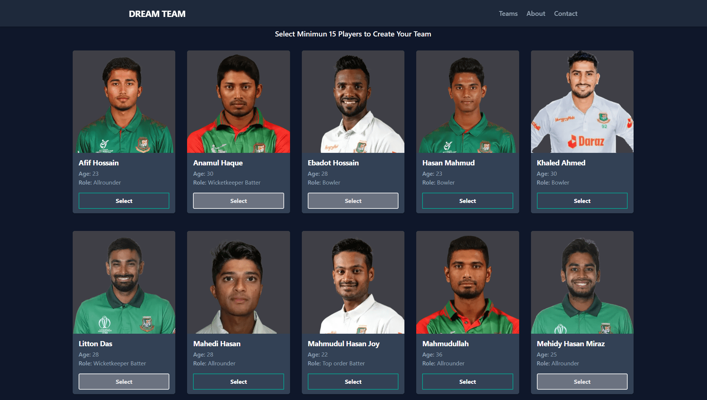
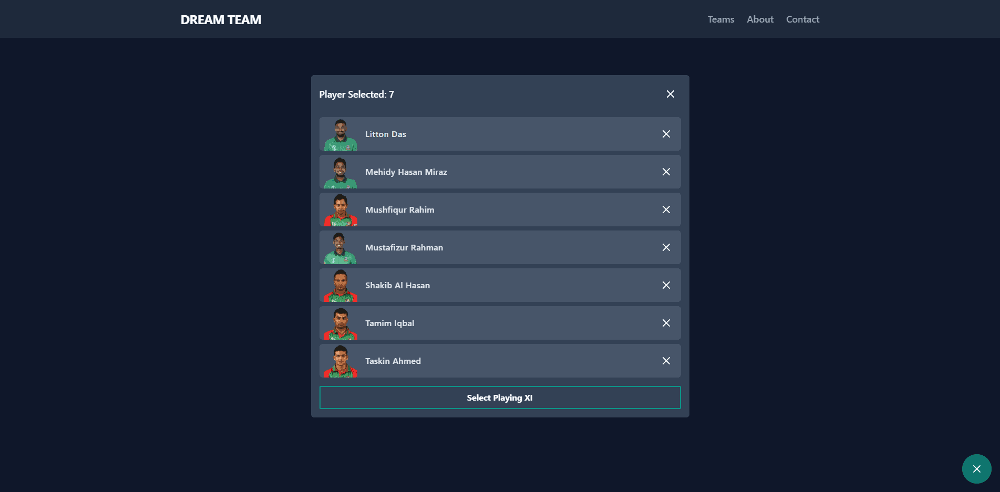

# Dream Team Selection

## Table of contents

- [Overview](#overview)
- [The challenge](#the-challenge)
- [Screenshot](#screenshot)
- [Links](#links)
- [Built with](#built-with)
- [What I learned](#what-i-learned)
- [Future Plan](#future-plan)
- [Useful resources](#useful-resources)
- [Author](#author)

## Overview

This is a react app that lists all of the Bangladesh cricket team's players. You can choose 15 players at random from among all of these players, and then you can choose 11 players at random from among the 15 players you've chosen. This website can also change theme(dark/light) according to your device theme.

### The challenge

- Show Optimal layout for the site depending on device's screen size
- Show hover states for all interactive elements on the page
- Have to use a CSS framework/library
- Have to create fake data and show that on the website

### Screenshot

Desktop View

Cart View

Mobile View

### Links

- Solution URL: [https://github.com/Mozahidul01/Dream-Team-Selection]

- Live Site URL: [https://dream-team-selection.netlify.app/]

### Built with

- React Js
- Tailwind CSS
- Post CSS
- React Feather Icon
- tailwind-scrollbar

### What I learned

I have used Tailwind CSS for the first time to develop any website. It was a great learning process for me. I learned a lot about Tailwind CSS. This Project also helps me a lot to under how logic works in Js. It was a fun learning process for me.

### Future Plan

I will add some features in the future. In the future users can create an 11 players team from the selected players. Users must select 15 players for creating a team and they can select a maximum of 18 players.

### Useful resources

- [TailwindCSS doc](https://tailwindcss.com/docs) - This Document help me to understand Tailwind CSS.
- [Feather Icon](https://feathericons.com/) - I have used this Icon pack in this project.
- [Tailwind Scrollbar](https://www.npmjs.com/package/tailwind-scrollbar) - I have used this package to create a custom scrollbar.

## Author

- Website - [https://mozahidul01.showwcase.com/]
- LinkdIn - [https://www.linkedin.com/in/mozahidul01]
- Github - [https://github.com/mozahidul01]
